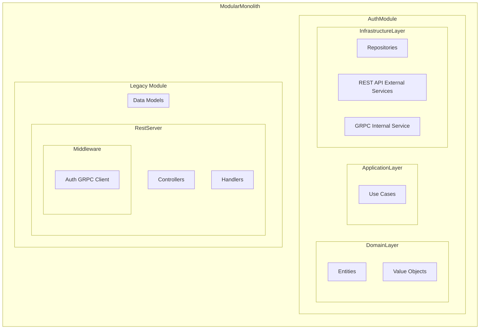

## Refactoring Greenlight application 

This project aims to refactor the Greenlight application by implementing clean architecture and SOLID principles. The goal is to improve the codebase's maintainability, scalability, and testability while increasing test coverage.

To understand the initial state of the project, please refer to the [previous README file](https://github.com/jessicatarra/greenlight/blob/main/README.md).

### API Docs from V1 application version
https://greenlight.tarralva.com/swagger/index.html

### Diagram

The diagram represents the initial phase of the refactor process, focusing on separating the auth module from the existing codebase and applying a clean architecture to enhance its maintainability to each new module. The main objective is to isolate the auth module's functionality and ensure that other modules access user-related information and authentication through the internal GRPC auth service.

### TODO
- [x] Implement a modular monolith architecture style
- [ ] Refactor initial implementation into separate modules 
  - [ ] Add an authentication module
    - [x] Implement the create user feature
    - [x] Implement the activate user feature
    - [x] Implement the create authentication token feature
    - [ ] Create auth specific middleware
  - [ ] Add a movies module
  - [ ] Add a healthcheck module
- [x] Refactor multiple functionalities into internal packages
  - [x] Add support for background tasks
  - [x] Add `log/slog` package
  - [x] Add `mailer` package
  - [x] Add utils package
    - [x] Add validator `v2` package
    - [x] Add validator helpers utilities
    - [x] Add general helpers utilities
  - [x] Add response package
  - [x] Add request package
  - [x] Add errors package
  - [x] Add config package
  - [x] Add shared middleware package

### References

- https://github.com/golang-standards/project-layout
- https://autostrada.dev/
- https://github.com/qiangxue/go-rest-api/tree/
- https://github.com/powerman/go-service-example/
- https://github.com/powerman/go-monolith-example
- https://github.com/amitshekhariitbhu/go-backend-clean-architecture
- https://github.com/evrone/go-clean-template/
- https://github.com/booscaaa/clean-go/
- https://github.com/bxcodec/go-clean-arch/
